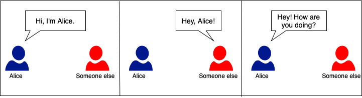
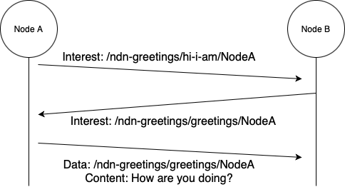
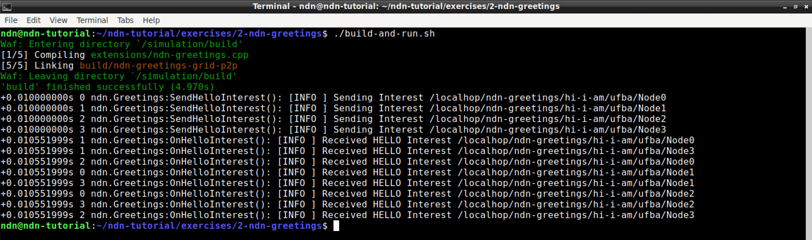
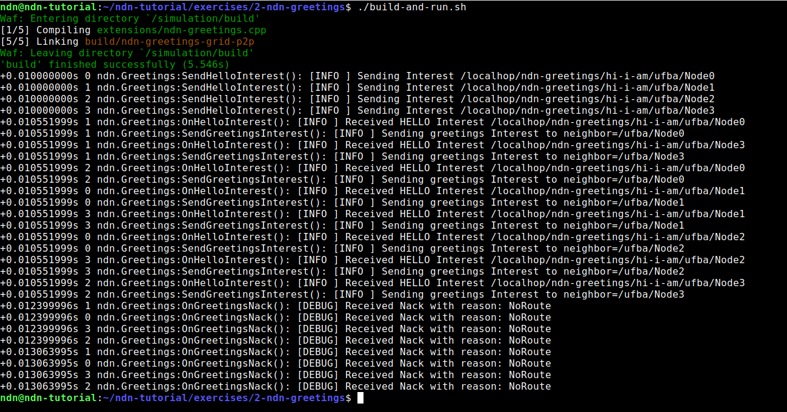

# NDN-Greetings: Simple Producer/Consumer Application

## Introduction

In this exercise, we will be using NDN-CXX API to create an application
to mimic the way people say Greetings in English. We will build our application
on top of the same structure that you used in the 
[NDN Helloworld](../1b-ndn_helloworld) exercise. The main difference is that
now we are building a more robust NDN application and each NDN node running
our application will act as a consumer and producer at the same time.

It is important to remember the way we are modeling English Greetings between
two or more entities:




In summary, usually it starts by someone introducing herself/himself, like:
A) _Hi, I am Foobar_. Then, whoever hears from A will greet in reply: B) 
_Hey, A!_. Moving forward, A will send a greetings back to B:
_How are you doing?_.

On our NDN Greetings application, the workflow will be pretty similar to
the one previously presented. More specifically, consider two NDN nodes
A and B. The NDN Greetings application will behaves like the following
workflow diagram:



In the above diagram, NodeA will send a hello message to introduce
itself so any reachable node will know about NodeA existence. This is
done through an Interest packet. Whoever receives the hello interest
from NodeA, will send a greetings interest using the naming schema
learned from the hello interest. Finally, NodeA will reply the
greetings interest with a greetings data. Since English has many ways
to say greetings, a random answer will be chosen. It is worthy to note
that NodeB will follow the same work flow as NodeA: NodeB will send a 
hello interest; NodeA will send a greetings interest upon receiving 
the hello interest from NodeB; NodeB will answer with a greetings data.

Let's get started!

> **Spoiler alert:** There is a reference solution in the `solution`
> sub-directory. Feel free to compare your implementation to the
> reference.

## Step 1: Run the (incomplete) NDN-Greetings application

The code for this module is located in the file named `ndn-greetings.cpp`,
inside the folder `extensions`, and it will be modified to implement the
application logic.

First of all, let's just compile and run the original application code, and
see what happens and what need to be done.

0. In your shell, make sure you are at the exercise folder:
   ```bash
   cd ~/ndn-tutorial/exercises/2-ndn-greetings
   ```

1. In your shell, run:
   ```bash
   ./start-docker.sh
   ```
   This will start our docker container with ndnSIM 2.8 and some
   customizations:
   * The source code of this exercise will be mounted as a volume at
     /ndn-greetings,
   * Some environment variables will be instantiated in order to allow you
     to run experiments using the graphical user interface (visualizer)
   * Speaking of the visualizer, right after the docker startup, we will
     apply a patch to fix minor problems on the visualizer

2. The next step will be compile the (incomplete) application:
   ```bash
   docker exec -it ndn-tutorial-e2 bash
   ./waf configure
   ./waf
   ```
   The commands above will i) switch to the docker container shell, ii) run
   waf build system to configure the build process and, finally, iii) build
   the (incomplete) application.

3. Now you can run the (incomplete) application and check the output:
   ```bash
   NS_LOG=ndn.Greetings ./waf --run "ndn-greetings-grid-p2p --nNodes=2"
   ```
   This will execute the whole simulation using the NDN-Greetings application
   in a point-to-point NxN grid scenario (N being `--nNodes` parameter). Since
   the application is incomplete, you should **only** see the nodes sending
   hello, but no other message. The output should looks like:
   ```bash
   ndn@ec2d9a371517:/simulation$ NS_LOG=ndn.Greetings ./waf --run "ndn-greetings-grid-p2p --nNodes=2"
   Waf: Entering directory `/simulation/build'
   Waf: Leaving directory `/simulation/build'
   'build' finished successfully (0.115s)
   +0.010000000s 0 ndn.Greetings:SendHelloInterest(): [INFO ] Sending Interest /localhop/ndn-greetings/hi-i-am/ufba/Node0
   +0.010000000s 1 ndn.Greetings:SendHelloInterest(): [INFO ] Sending Interest /localhop/ndn-greetings/hi-i-am/ufba/Node1
   +0.010000000s 2 ndn.Greetings:SendHelloInterest(): [INFO ] Sending Interest /localhop/ndn-greetings/hi-i-am/ufba/Node2
   +0.010000000s 3 ndn.Greetings:SendHelloInterest(): [INFO ] Sending Interest /localhop/ndn-greetings/hi-i-am/ufba/Node3
   ```

4. You can exit the docker container for now and go back to the virtual
   machine shell:
   ```bash
   exit
   ```
   In the next section, we will modify the application to listen to those
   hello messages.

## Step 2: Listening to hello messages and discovering nodes

The next step towards our complete NDN-Greetings application is to listen
to hello interests and discovery nodes.

1. Listening to a prefix name in NDN usually means create a FIB entry
   with next-hop being the application face, or configure an interest
   filter for the prefix on the application face. To implement this change, we
   will modify the file `extensions/ndn-greetings.cpp`
   (the virtual machine includes two text editors: vim and mousepad). Look
   for `TODO 1` in the code. Right after the TODO comment, you should insert
   the code to set the interest filter:
   ```cpp
     Name appHelloPrefix = Name(m_appPrefix);
     appHelloPrefix.append(kHelloType);
     m_face.setInterestFilter(appHelloPrefix, std::bind(&NdnGreetings::OnHelloInterest, this, _2),
       [this](const Name&, const std::string& reason) {
         throw std::runtime_error("Failed to register sync interest prefix: " + reason);
     });
   ```
   You should notice that the code above will call the function 
   `NdnGreetings::OnHelloInterest` upon receiving an interest for the
   prefix name `/<m_appPrefix>/<kHelloType>`. The next step will look
   into that function.
   It is worthy mentioning that, since we have created an interest filter
   under the same naming prefix in which we send out interest hello messages,
   some adjustments were necessary to make sure the application would work
   properly (see more information in the subsection *A note about routing*).

2. Now that our application is listening to the hello interests, it will be
   able to discovery neighbors. Once we discovery a new neighbor we can send
   greetings interest for it. To implement this logic, we will keep modifying
   the file `extensions/ndn-greetings.cpp`, more
   specifically `TODO 2`. You can insert the following code right after the
   TODO comment:
   ```cpp
     std::string neighName = interestName.getSubName(m_appPrefix.size()+1).toUri();
   
     auto neigh = m_neighMap.find(neighName);
     if (neigh == m_neighMap.end()) {
       SendGreetingsInterest(neighName);
     } else {
       MYLOG_INFO("Skipping already known neighbor" << neighName);
     }
   ```
   The code above has two main blocks: 1) extract the neighbor name; 2) call 
   `SendGreetingsInterest()` for new neighbors. Extracting the neighbor name
   is basically processing the interest name and ignoring the first components
   correspondent to application prefix (e.g., `/localhop/ndn-greetings`) plus
   the hello type name component (e.g., 'hi-i-am'). Right after those two name
   components, there will be the node name.
   Once we've extracted the neighbor name, it is time to send greetings interest
   to the new neighbor. Our application utilize a map data structure to keep
   track of neighbors.

3. Having done the modifications above, let's see how the application will
   perform! The next command will compile and run the application inside the
   docker container, all in a single command:
   ```bash
   ./build-and-run.sh
   ```
   You should see an output similar to:



### A note about routing

As we mentioned above, once we've set the interest filter on the application
face under the same naming prefix which we send out interest hello message, we
had to make some adjustments on the node's routing configuration. In summary,
the adjustments were:
- We have to create an additional FIB entry to forward interest packets out of
  all the non-local faces (i.e., the faces associated with the point-to-point
  network devices).
- We have to use Multicast forwarding strategy, for all name prefixes or at
  least for the application name prefix

This is necessary because our application plays the role of producers and
consumers at the same time. Thus, as a consumer there is a FIB entry that
instructs NFD to forward interests out of the non-local faces (i.e., faces
connecting the node to other nodes through the point-to-point links). As a
producer, the node has a FIB entry the instructs NFD to forward interests to
the local application face. Futhermore, in this situation, the forwarding
strategy for the name prefix has to be Multicast, to ensure the an interest
will be forwarded to both local and non-local faces.


## Step 3: Sending Greetings Interest upon discovering nodes

Now it is time to send out greetings interest upon discovering nodes.

1. In the previous step, we've created a code to call the `SendGreetingsInterest()`
   function. Now, we are going to implement that function to actually send
   out the greetings interest. To do so, edit the file 
   `extensions/ndn-greetings.cpp` specially in the *TODO 3*. Right after the TODO 
   comment, you should insert the following
   code:
   ```cpp
     MYLOG_INFO("Sending greetings Interest to neighbor=" << neighName);
     Name name = Name(m_appPrefix);
     name.append(kGreetingsType);
     name.append(neighName);
   
     Interest interest = Interest();
     interest.setNonce(m_rand_nonce(m_rengine));
     interest.setName(name);
     interest.setCanBePrefix(false);
     interest.setMustBeFresh(true);
     interest.setInterestLifetime(time::seconds(5));
   
     m_face.expressInterest(interest,
       std::bind(&NdnGreetings::OnGreetingsContent, this, _1, _2),
       std::bind(&NdnGreetings::OnGreetingsNack, this, _1, _2),
       std::bind(&NdnGreetings::OnGreetingsTimedOut, this, _1));
   ```
   There are many important aspects in the code above:
   - First of all, we need to pay attention on how we are composing
     the name prefix: m_appPrefix + kGreetingsType + neighName. That
     means we will send an interest that can only be satisfied by the
     producer/neighbor (and, of course, the opportunistic cache
     torwards the producer)
   - Then we create an Interest object and, among many other
     attributes, we set the Interest Lifetime: how much time the
     interest will be waiting to be replied (i.e., it will remain
     in the PIT).
   - Finally, when expressing the interest -- i.e., sending the interest
     out of the application face to be handled by NFD --, we define three
     callback functions: OnGreetingsContent, OnGreetingsNack and
     OnGreetingsTimedOut. The name of the functions are pretty explanat

2. Let's run the application and see how it will behave:
   ```bash
   ./build-and-run.sh
   ```
   As a result you should see something similar to the following output:



   From the output above, we can see that the application is sending
   greetings interest, but we also see other interesting aspects:
   - As we just mentioned, upon receiving the hello interest (OnHelloInterest)
     each node will send a greetings interest using the same naming prefix
     learned from the neighbor (SendGreetingsInterest)
   - Just a few milliseconds later, each node receives a NACK message of the
     type NoRoute. What is that?
   - Even though all nodes have a default route pointing to each other and
     none of them are able to satisfy the greeting interest, no loop happens.
     Why is that?

## Step 4: Replying to Greetings Interest

TODO

1. The last step will be to implement the function that answer the greetings
   interest. Our application will randomly select one greetings expression 
   and sent it in a data packet. To do so, edit the file 
   `extensions/ndn-greetings.cpp` specially in the
   *TODO 4*. Right after the TODO comment, you should insert the following
   code:

2. Fix *TODO 5*

TODO: a note about Content Store

## Next Steps

Congratulations, your implementation works! Move onto the next assignment
[Signed NDN-Greetings](../3-signed-ndn-greetings)!
